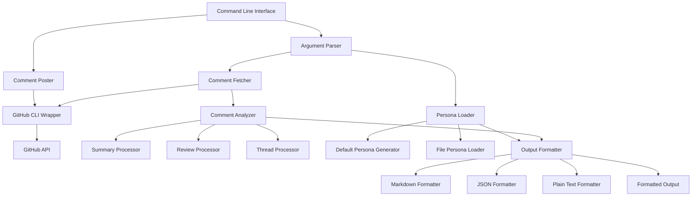

# Design Document

## Overview

This document outlines the technical design for the CodeRabbit Comment Fetcher, a Python 3.13 script that retrieves and formats CodeRabbit comments from GitHub pull requests. The tool leverages GitHub CLI for authenticated API access and provides AI-optimized output formatting.

## Architecture

### High-Level Architecture



### Core Components

1. **Command Line Interface**: Entry point handling argument parsing and orchestration
2. **Comment Fetcher**: GitHub CLI integration for retrieving PR comments
3. **Comment Analyzer**: Core logic for parsing and categorizing CodeRabbit comments
4. **Persona Manager**: Handles persona file loading and default persona generation
5. **Output Formatter**: Multi-format output generation optimized for AI consumption
6. **Comment Poster**: Optional functionality for posting resolution requests

## Components and Interfaces

### 1. Command Line Interface (`cli.py`)

```python
class CodeRabbitFetcher:
    def __init__(self):
        self.parser = ArgumentParser()
        self.setup_arguments()
    
    def setup_arguments(self):
        # PR URL (required)
        # Persona file (optional)
        # Output format (optional, default: markdown)
        # Resolved marker (optional, default: 🔒 CODERABBIT_RESOLVED 🔒)
        # Request resolution (optional flag)
        pass
    
    def run(self, args: List[str]) -> int:
        # Main execution flow
        pass
```

### 2. GitHub CLI Wrapper (`github_client.py`)

```python
class GitHubClient:
    def __init__(self):
        self.check_authentication()
    
    def check_authentication(self) -> bool:
        # Verify gh CLI is authenticated
        pass
    
    def fetch_pr_comments(self, pr_url: str) -> Dict[str, Any]:
        # Execute: gh pr view <url> --comments --json
        pass
    
    def post_comment(self, pr_url: str, comment: str) -> bool:
        # Execute: gh pr comment <url> --body <comment>
        pass
    
    def parse_pr_url(self, url: str) -> Tuple[str, str, int]:
        # Extract owner, repo, pr_number from URL
        pass
```

### 3. Comment Analyzer (`comment_analyzer.py`)

```python
class CommentAnalyzer:
    def __init__(self, resolved_marker: str = "🔒 CODERABBIT_RESOLVED 🔒"):
        self.resolved_marker = resolved_marker
        self.summary_processor = SummaryProcessor()
        self.review_processor = ReviewProcessor()
        self.thread_processor = ThreadProcessor()
    
    def analyze_comments(self, comments_data: Dict) -> AnalyzedComments:
        # Filter CodeRabbit comments
        # Categorize comment types
        # Process threads and resolution status
        pass
    
    def filter_coderabbit_comments(self, comments: List[Dict]) -> List[Dict]:
        # Filter by author: "coderabbitai"
        pass
    
    def is_resolved(self, comment_thread: List[Dict]) -> bool:
        # Check for resolved marker in last CodeRabbit reply
        pass
```

### 4. Comment Processors

#### Summary Processor (`processors/summary_processor.py`)

```python
class SummaryProcessor:
    def process_summary_comment(self, comment: Dict) -> SummaryComment:
        # Extract "Summary by CodeRabbit" sections
        # Parse new features, documentation, tests
        # Extract walkthrough and changes table
        # Handle sequence diagrams
        pass
    
    def extract_changes_table(self, content: str) -> List[ChangeEntry]:
        pass
    
    def extract_sequence_diagram(self, content: str) -> Optional[str]:
        pass
```

#### Review Processor (`processors/review_processor.py`)

```python
class ReviewProcessor:
    def process_review_comment(self, comment: Dict) -> ReviewComment:
        # Extract actionable comments count
        # Process nitpick comments
        # Process outside diff range comments
        # Handle AI agent prompts
        pass
    
    def extract_actionable_comments(self, content: str) -> List[ActionableComment]:
        pass
    
    def extract_nitpick_comments(self, content: str) -> List[NitpickComment]:
        pass
    
    def extract_outside_diff_comments(self, content: str) -> List[OutsideDiffComment]:
        pass
    
    def extract_ai_agent_prompts(self, content: str) -> List[AIAgentPrompt]:
        pass
```

#### Thread Processor (`processors/thread_processor.py`)

```python
class ThreadProcessor:
    def process_thread(self, thread_comments: List[Dict]) -> ThreadContext:
        # Analyze thread structure
        # Extract CodeRabbit comments chronologically
        # Determine resolution status
        # Generate contextual information for AI
        pass
    
    def build_thread_context(self, comments: List[Dict]) -> ThreadContext:
        pass
```

### 5. Persona Manager (`persona_manager.py`)

```python
class PersonaManager:
    def __init__(self):
        self.default_persona_generator = DefaultPersonaGenerator()
    
    def load_persona(self, persona_file: Optional[str]) -> str:
        if persona_file:
            return self.load_from_file(persona_file)
        return self.default_persona_generator.generate()
    
    def load_from_file(self, file_path: str) -> str:
        # Read and validate persona file
        pass

class DefaultPersonaGenerator:
    def generate(self) -> str:
        # Generate Claude 4 best practices optimized persona
        # Include role definition, task instructions, output format
        pass
```

### 6. Output Formatters (`formatters/`)

#### Base Formatter (`formatters/base_formatter.py`)

```python
class BaseFormatter(ABC):
    @abstractmethod
    def format(self, persona: str, analyzed_comments: AnalyzedComments) -> str:
        pass
    
    def format_ai_agent_prompt(self, prompt: AIAgentPrompt) -> str:
        # Special handling for AI agent code blocks
        pass
    
    def format_thread_context(self, thread: ThreadContext) -> str:
        # Claude 4 best practices structured format
        pass
```

#### Markdown Formatter (`formatters/markdown_formatter.py`)

```python
class MarkdownFormatter(BaseFormatter):
    def format(self, persona: str, analyzed_comments: AnalyzedComments) -> str:
        # Generate markdown with proper headings, lists, code blocks
        # Visually distinguish comment types
        # Preserve AI agent prompts as-is
        pass
    
    def format_summary_section(self, summary: SummaryComment) -> str:
        pass
    
    def format_review_section(self, review: ReviewComment) -> str:
        pass
    
    def format_actionable_comments(self, comments: List[ActionableComment]) -> str:
        pass
    
    def format_nitpick_comments(self, comments: List[NitpickComment]) -> str:
        pass
    
    def format_outside_diff_comments(self, comments: List[OutsideDiffComment]) -> str:
        pass
```

#### JSON Formatter (`formatters/json_formatter.py`)

```python
class JSONFormatter(BaseFormatter):
    def format(self, persona: str, analyzed_comments: AnalyzedComments) -> str:
        # Generate structured JSON for programmatic consumption
        pass
```

### 7. Comment Poster (`comment_poster.py`)

```python
class CommentPoster:
    def __init__(self, github_client: GitHubClient):
        self.github_client = github_client
    
    def post_resolution_request(self, pr_url: str, resolved_marker: str) -> bool:
        comment = self.generate_resolution_request(resolved_marker)
        return self.github_client.post_comment(pr_url, comment)
    
    def generate_resolution_request(self, resolved_marker: str) -> str:
        return f"@coderabbitai Please verify HEAD and add resolved marker {resolved_marker} if there are no issues"
```

## Data Models

### Core Data Structures (`models/`)

```python
@dataclass
class AnalyzedComments:
    summary_comments: List[SummaryComment]
    review_comments: List[ReviewComment]
    unresolved_threads: List[ThreadContext]
    metadata: CommentMetadata

@dataclass
class SummaryComment:
    new_features: List[str]
    documentation_changes: List[str]
    test_changes: List[str]
    walkthrough: str
    changes_table: List[ChangeEntry]
    sequence_diagram: Optional[str]
    raw_content: str

@dataclass
class ReviewComment:
    actionable_count: int
    actionable_comments: List[ActionableComment]
    nitpick_comments: List[NitpickComment]
    outside_diff_comments: List[OutsideDiffComment]
    raw_content: str

@dataclass
class ActionableComment:
    file_path: str
    line_range: str
    issue_description: str
    ai_agent_prompt: Optional[AIAgentPrompt]
    thread_context: Optional[ThreadContext]

@dataclass
class AIAgentPrompt:
    code_block: str
    language: str
    description: str

@dataclass
class ThreadContext:
    main_comment: Dict
    replies: List[Dict]
    resolution_status: str
    chronological_order: List[Dict]
    contextual_summary: str
```

## Error Handling

### Exception Hierarchy

```python
class CodeRabbitFetcherError(Exception):
    """Base exception for CodeRabbit Fetcher"""
    pass

class GitHubAuthenticationError(CodeRabbitFetcherError):
    """GitHub CLI authentication issues"""
    pass

class InvalidPRUrlError(CodeRabbitFetcherError):
    """Invalid pull request URL format"""
    pass

class PersonaFileError(CodeRabbitFetcherError):
    """Persona file reading issues"""
    pass

class CommentParsingError(CodeRabbitFetcherError):
    """Comment content parsing issues"""
    pass

class APIRateLimitError(CodeRabbitFetcherError):
    """GitHub API rate limit exceeded"""
    pass
```

### Error Handling Strategy

1. **GitHub CLI Issues**: Check authentication, provide clear instructions
2. **API Rate Limits**: Implement exponential backoff, inform user of limits
3. **Parsing Errors**: Log warnings, continue with partial data when possible
4. **File I/O Errors**: Provide specific error messages with file paths
5. **Network Issues**: Retry with timeout, fail gracefully

## Testing Strategy

### Unit Tests

1. **Comment Parsing**: Test with various CodeRabbit comment formats
2. **Persona Generation**: Verify Claude 4 best practices compliance
3. **Output Formatting**: Validate all output formats
4. **Thread Processing**: Test complex thread scenarios
5. **Resolved Marker Detection**: Test edge cases and false positives

### Integration Tests

1. **GitHub CLI Integration**: Mock gh commands, test error scenarios
2. **End-to-End Workflow**: Test complete flow with sample data
3. **File I/O Operations**: Test persona file loading and error cases

### Test Data

- Sample CodeRabbit comments from real PRs
- Various thread configurations
- Edge cases for resolved marker detection
- Invalid input scenarios

## Configuration and Deployment

### Environment Setup

```toml
# pyproject.toml
[project]
name = "coderabbit-comment-fetcher"
version = "1.0.0"
description = "Fetch and format CodeRabbit comments from GitHub PRs"
requires-python = ">=3.13"
dependencies = [
    "click>=8.0.0",
    "pydantic>=2.0.0",
    "rich>=13.0.0",
]

[project.scripts]
coderabbit-fetch = "coderabbit_fetcher.cli:main"

[build-system]
requires = ["hatchling"]
build-backend = "hatchling.build"
```

### uvx Compatibility

- Ensure all dependencies are properly declared
- Include entry point for direct execution
- Handle virtual environment creation automatically

### Default Configuration

```python
DEFAULT_CONFIG = {
    "resolved_marker": "🔒 CODERABBIT_RESOLVED 🔒",
    "output_format": "markdown",
    "max_retries": 3,
    "timeout": 30,
    "claude_best_practices_url": "https://docs.anthropic.com/en/docs/build-with-claude/prompt-engineering/claude-4-best-practices.md"
}
```

## Security Considerations

1. **GitHub Token Security**: Rely on gh CLI authentication, never store tokens
2. **Input Validation**: Sanitize all user inputs, validate URLs
3. **File Access**: Restrict persona file access to specified paths
4. **Command Injection**: Use subprocess safely with proper argument handling
5. **Data Privacy**: Handle comment content securely, no persistent storage

## Performance Considerations

1. **API Efficiency**: Minimize GitHub API calls, use batch operations when possible
2. **Memory Usage**: Stream large comment data, avoid loading everything in memory
3. **Parsing Optimization**: Use efficient regex patterns, cache compiled patterns
4. **Output Generation**: Generate output incrementally for large datasets

## Future Enhancements

1. **Caching**: Cache comment data to reduce API calls
2. **Batch Processing**: Support multiple PRs in single execution
3. **Custom Templates**: Allow custom output templates
4. **Integration**: Webhook support for automatic processing
5. **Analytics**: Comment resolution tracking and metrics