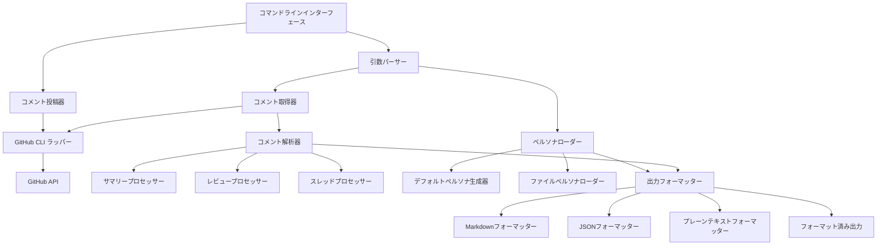

# 設計ドキュメント

## 概要

このドキュメントは、GitHubプルリクエストからCodeRabbitコメントを取得・フォーマットするPython 3.13スクリプト「CodeRabbit Comment Fetcher」の技術設計を説明します。このツールは認証済みAPIアクセスのためにGitHub CLIを活用し、AI最適化された出力フォーマットを提供します。

## アーキテクチャ

### 高レベルアーキテクチャ



### コアコンポーネント

1. **コマンドラインインターフェース**: 引数解析とオーケストレーションを処理するエントリーポイント
2. **コメント取得器**: PRコメント取得のためのGitHub CLI統合
3. **コメント解析器**: CodeRabbitコメントの解析・分類のためのコアロジック
4. **ペルソナマネージャー**: ペルソナファイル読み込みとデフォルトペルソナ生成を処理
5. **出力フォーマッター**: AI消費に最適化されたマルチフォーマット出力生成
6. **コメント投稿器**: 解決依頼投稿のためのオプション機能

## コンポーネントとインターフェース

### 1. コマンドラインインターフェース (`cli.py`)

```python
class CodeRabbitFetcher:
    def __init__(self):
        self.parser = ArgumentParser()
        self.setup_arguments()
    
    def setup_arguments(self):
        # PR URL (必須)
        # ペルソナファイル (オプション)
        # 出力形式 (オプション、デフォルト: markdown)
        # 解決済みマーカー (オプション、デフォルト: 🔒 CODERABBIT_RESOLVED 🔒)
        # 解決依頼 (オプションフラグ)
        pass
    
    def run(self, args: List[str]) -> int:
        # メイン実行フロー
        pass
```

### 2. GitHub CLI ラッパー (`github_client.py`)

```python
class GitHubClient:
    def __init__(self):
        self.check_authentication()
    
    def check_authentication(self) -> bool:
        # gh CLIが認証済みかを確認
        pass
    
    def fetch_pr_comments(self, pr_url: str) -> Dict[str, Any]:
        # 実行: gh pr view <url> --comments --json
        pass
    
    def post_comment(self, pr_url: str, comment: str) -> bool:
        # 実行: gh pr comment <url> --body <comment>
        pass
    
    def parse_pr_url(self, url: str) -> Tuple[str, str, int]:
        # URLからowner, repo, pr_numberを抽出
        pass
```

### 3. コメント解析器 (`comment_analyzer.py`)

```python
class CommentAnalyzer:
    def __init__(self, resolved_marker: str = "🔒 CODERABBIT_RESOLVED 🔒"):
        self.resolved_marker = resolved_marker
        self.summary_processor = SummaryProcessor()
        self.review_processor = ReviewProcessor()
        self.thread_processor = ThreadProcessor()
    
    def analyze_comments(self, comments_data: Dict) -> AnalyzedComments:
        # CodeRabbitコメントをフィルタリング
        # コメントタイプを分類
        # スレッドと解決状況を処理
        pass
    
    def filter_coderabbit_comments(self, comments: List[Dict]) -> List[Dict]:
        # 作成者でフィルタリング: "coderabbitai"
        pass
    
    def is_resolved(self, comment_thread: List[Dict]) -> bool:
        # 最後のCodeRabbit返信で解決済みマーカーをチェック
        pass
```

### 4. コメントプロセッサー

#### サマリープロセッサー (`processors/summary_processor.py`)

```python
class SummaryProcessor:
    def process_summary_comment(self, comment: Dict) -> SummaryComment:
        # "Summary by CodeRabbit"セクションを抽出
        # 新機能、ドキュメント、テストを解析
        # ウォークスルーと変更テーブルを抽出
        # シーケンス図を処理
        pass
    
    def extract_changes_table(self, content: str) -> List[ChangeEntry]:
        pass
    
    def extract_sequence_diagram(self, content: str) -> Optional[str]:
        pass
```

#### レビュープロセッサー (`processors/review_processor.py`)

```python
class ReviewProcessor:
    def process_review_comment(self, comment: Dict) -> ReviewComment:
        # アクション可能コメント数を抽出
        # ニットピックコメントを処理
        # 差分範囲外コメントを処理
        # AIエージェントプロンプトを処理
        pass
    
    def extract_actionable_comments(self, content: str) -> List[ActionableComment]:
        pass
    
    def extract_nitpick_comments(self, content: str) -> List[NitpickComment]:
        pass
    
    def extract_outside_diff_comments(self, content: str) -> List[OutsideDiffComment]:
        pass
    
    def extract_ai_agent_prompts(self, content: str) -> List[AIAgentPrompt]:
        pass
```

#### スレッドプロセッサー (`processors/thread_processor.py`)

```python
class ThreadProcessor:
    def process_thread(self, thread_comments: List[Dict]) -> ThreadContext:
        # スレッド構造を分析
        # CodeRabbitコメントを時系列順に抽出
        # 解決状況を判定
        # AI向けの文脈情報を生成
        pass
    
    def build_thread_context(self, comments: List[Dict]) -> ThreadContext:
        pass
```

### 5. ペルソナマネージャー (`persona_manager.py`)

```python
class PersonaManager:
    def __init__(self):
        self.default_persona_generator = DefaultPersonaGenerator()
    
    def load_persona(self, persona_file: Optional[str]) -> str:
        if persona_file:
            return self.load_from_file(persona_file)
        return self.default_persona_generator.generate()
    
    def load_from_file(self, file_path: str) -> str:
        # ペルソナファイルを読み込み・検証
        pass

class DefaultPersonaGenerator:
    def generate(self) -> str:
        # Claude 4ベストプラクティス最適化ペルソナを生成
        # 役割定義、タスク指示、出力形式を含める
        pass
```

### 6. 出力フォーマッター (`formatters/`)

#### ベースフォーマッター (`formatters/base_formatter.py`)

```python
class BaseFormatter(ABC):
    @abstractmethod
    def format(self, persona: str, analyzed_comments: AnalyzedComments) -> str:
        pass
    
    def format_ai_agent_prompt(self, prompt: AIAgentPrompt) -> str:
        # AIエージェントコードブロックの特別処理
        pass
    
    def format_thread_context(self, thread: ThreadContext) -> str:
        # Claude 4ベストプラクティス構造化形式
        pass
```

#### Markdownフォーマッター (`formatters/markdown_formatter.py`)

```python
class MarkdownFormatter(BaseFormatter):
    def format(self, persona: str, analyzed_comments: AnalyzedComments) -> str:
        # 適切な見出し、リスト、コードブロックでMarkdownを生成
        # コメントタイプを視覚的に区別
        # AIエージェントプロンプトをそのまま保持
        pass
    
    def format_summary_section(self, summary: SummaryComment) -> str:
        pass
    
    def format_review_section(self, review: ReviewComment) -> str:
        pass
    
    def format_actionable_comments(self, comments: List[ActionableComment]) -> str:
        pass
    
    def format_nitpick_comments(self, comments: List[NitpickComment]) -> str:
        pass
    
    def format_outside_diff_comments(self, comments: List[OutsideDiffComment]) -> str:
        pass
```

#### JSONフォーマッター (`formatters/json_formatter.py`)

```python
class JSONFormatter(BaseFormatter):
    def format(self, persona: str, analyzed_comments: AnalyzedComments) -> str:
        # プログラム的消費のための構造化JSON生成
        pass
```

### 7. コメント投稿器 (`comment_poster.py`)

```python
class CommentPoster:
    def __init__(self, github_client: GitHubClient):
        self.github_client = github_client
    
    def post_resolution_request(self, pr_url: str, resolved_marker: str) -> bool:
        comment = self.generate_resolution_request(resolved_marker)
        return self.github_client.post_comment(pr_url, comment)
    
    def generate_resolution_request(self, resolved_marker: str) -> str:
        return f"@coderabbitai HEADを確認して問題がなければ解決済みマーカー{resolved_marker}を付けてください"
```

## データモデル

### コアデータ構造 (`models/`)

```python
@dataclass
class AnalyzedComments:
    summary_comments: List[SummaryComment]
    review_comments: List[ReviewComment]
    unresolved_threads: List[ThreadContext]
    metadata: CommentMetadata

@dataclass
class SummaryComment:
    new_features: List[str]
    documentation_changes: List[str]
    test_changes: List[str]
    walkthrough: str
    changes_table: List[ChangeEntry]
    sequence_diagram: Optional[str]
    raw_content: str

@dataclass
class ReviewComment:
    actionable_count: int
    actionable_comments: List[ActionableComment]
    nitpick_comments: List[NitpickComment]
    outside_diff_comments: List[OutsideDiffComment]
    raw_content: str

@dataclass
class ActionableComment:
    file_path: str
    line_range: str
    issue_description: str
    ai_agent_prompt: Optional[AIAgentPrompt]
    thread_context: Optional[ThreadContext]

@dataclass
class AIAgentPrompt:
    code_block: str
    language: str
    description: str

@dataclass
class ThreadContext:
    main_comment: Dict
    replies: List[Dict]
    resolution_status: str
    chronological_order: List[Dict]
    contextual_summary: str
```

## エラーハンドリング

### 例外階層

```python
class CodeRabbitFetcherError(Exception):
    """CodeRabbit Fetcherのベース例外"""
    pass

class GitHubAuthenticationError(CodeRabbitFetcherError):
    """GitHub CLI認証問題"""
    pass

class InvalidPRUrlError(CodeRabbitFetcherError):
    """無効なプルリクエストURL形式"""
    pass

class PersonaFileError(CodeRabbitFetcherError):
    """ペルソナファイル読み込み問題"""
    pass

class CommentParsingError(CodeRabbitFetcherError):
    """コメント内容解析問題"""
    pass

class APIRateLimitError(CodeRabbitFetcherError):
    """GitHub APIレート制限超過"""
    pass
```

### エラーハンドリング戦略

1. **GitHub CLI問題**: 認証をチェック、明確な指示を提供
2. **APIレート制限**: 指数バックオフを実装、制限をユーザーに通知
3. **解析エラー**: 警告をログ、可能な場合は部分データで継続
4. **ファイルI/Oエラー**: ファイルパスを含む具体的なエラーメッセージを提供
5. **ネットワーク問題**: タイムアウト付きリトライ、グレースフル失敗

## テスト戦略

### 単体テスト

1. **コメント解析**: 様々なCodeRabbitコメント形式でテスト
2. **ペルソナ生成**: Claude 4ベストプラクティス準拠を検証
3. **出力フォーマット**: 全出力形式を検証
4. **スレッド処理**: 複雑なスレッドシナリオをテスト
5. **解決済みマーカー検出**: エッジケースと誤検出をテスト

### 統合テスト

1. **GitHub CLI統合**: ghコマンドをモック、エラーシナリオをテスト
2. **エンドツーエンドワークフロー**: サンプルデータで完全フローをテスト
3. **ファイルI/O操作**: ペルソナファイル読み込みとエラーケースをテスト

### テストデータ

- 実際のPRからのサンプルCodeRabbitコメント
- 様々なスレッド構成
- 解決済みマーカー検出のエッジケース
- 無効入力シナリオ

## 設定とデプロイメント

### 環境セットアップ

```toml
# pyproject.toml
[project]
name = "coderabbit-comment-fetcher"
version = "1.0.0"
description = "GitHubプルリクエストからCodeRabbitコメントを取得・フォーマット"
requires-python = ">=3.13"
dependencies = [
    "click>=8.0.0",
    "pydantic>=2.0.0",
    "rich>=13.0.0",
]

[project.scripts]
coderabbit-fetch = "coderabbit_fetcher.cli:main"

[build-system]
requires = ["hatchling"]
build-backend = "hatchling.build"
```

### uvx互換性

- 全ての依存関係が適切に宣言されていることを確保
- 直接実行のためのエントリーポイントを含める
- 仮想環境作成を自動的に処理

### デフォルト設定

```python
DEFAULT_CONFIG = {
    "resolved_marker": "🔒 CODERABBIT_RESOLVED 🔒",
    "output_format": "markdown",
    "max_retries": 3,
    "timeout": 30,
    "claude_best_practices_url": "https://docs.anthropic.com/en/docs/build-with-claude/prompt-engineering/claude-4-best-practices.md"
}
```

## セキュリティ考慮事項

1. **GitHubトークンセキュリティ**: gh CLI認証に依存、トークンを保存しない
2. **入力検証**: 全ユーザー入力をサニタイズ、URLを検証
3. **ファイルアクセス**: ペルソナファイルアクセスを指定パスに制限
4. **コマンドインジェクション**: 適切な引数処理でsubprocessを安全に使用
5. **データプライバシー**: コメント内容を安全に処理、永続ストレージなし

## パフォーマンス考慮事項

1. **API効率**: GitHub API呼び出しを最小化、可能な場合はバッチ操作を使用
2. **メモリ使用量**: 大きなコメントデータをストリーム、全てをメモリに読み込まない
3. **解析最適化**: 効率的な正規表現パターンを使用、コンパイル済みパターンをキャッシュ
4. **出力生成**: 大きなデータセットに対して出力を段階的に生成

## 将来の拡張

1. **キャッシュ**: API呼び出しを減らすためのコメントデータキャッシュ
2. **バッチ処理**: 単一実行での複数PR対応
3. **カスタムテンプレート**: カスタム出力テンプレートの許可
4. **統合**: 自動処理のためのWebhookサポート
5. **分析**: コメント解決追跡とメトリクス