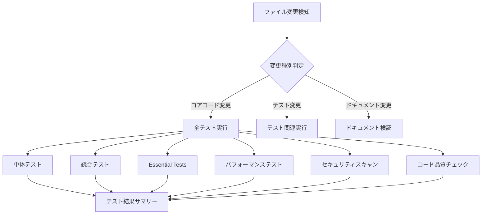

# 🚀 CI/CD パイプライン設定ガイド

## 📋 概要

CodeRabbit Fetcherプロジェクトに包括的なCI/CDパイプラインを実装しました。これにより、`get_github_coderabbit_review/` 配下のファイル変更時に自動的にテストが実行されます。

## 🏗️ CI/CDアーキテクチャ

### 📊 ワークフロー構成



## 🔧 ワークフローファイル一覧

### 1. 🧪 **test-coderabbit-fetcher.yml** - メインテストパイプライン
- **トリガー**: `get_github_coderabbit_review/` 配下のコード変更
- **除外**: Markdownファイル、docsディレクトリ、examplesディレクトリ
- **実行内容**:
  - 変更検知とフィルタリング
  - 単体テスト（Python 3.11 & 3.12）
  - 統合テスト
  - Essential Tests（PR38/PR2モック化テスト）
  - パフォーマンステスト
  - コード品質チェック
  - テスト結果サマリー生成

### 2. 🎨 **lint-and-format.yml** - コード品質維持
- **トリガー**: Pythonファイル変更時
- **実行内容**:
  - Ruffによるリンティング
  - Blackによるフォーマットチェック
  - isortによるimport整理チェック
  - mypyによる型チェック（警告のみ）
  - 自動修正（pushイベント時、mainブランチ以外）

### 3. 🔒 **security-scan.yml** - セキュリティ監査
- **トリガー**: コード変更時 + 毎日定期実行
- **実行内容**:
  - Safetyによる依存関係脆弱性チェック
  - Banditによるセキュリティリンティング
  - Semgrepによる高度なセキュリティ分析
  - GitHub Security Advisoriesとの連携

### 4. 📚 **docs-update.yml** - ドキュメント品質管理
- **トリガー**: Markdownファイル変更時
- **実行内容**:
  - Markdownlintによるフォーマットチェック
  - コード変更とドキュメント更新の同期チェック

## 🎯 重要なポイント

### ✅ **PR38テストのモック化完了**
- `test_pr38_direct.py` を完全にモック化
- GitHub API認証不要で実行可能
- CI環境での安定した動作を保証

### 🔍 **智能ファイル変更検知**
- `dorny/paths-filter` アクションを使用
- コアコード、テスト、設定ファイルを適切に分類
- 不要なワークフロー実行を防止

### 📊 **包括的なテスト戦略**
- **単体テスト**: 個別コンポーネントの動作確認
- **統合テスト**: システム連携の検証
- **Essential Tests**: 実際のPRケースでの動作確認（モック使用）
- **パフォーマンステスト**: 性能要件の確認

## 🚀 使用方法

### 1. 検証スクリプトの実行
```bash
# CI/CD設定の検証
./get_github_coderabbit_review/scripts/validate-ci.sh
```

### 2. ローカルでのテスト実行
```bash
cd get_github_coderabbit_review

# Essential Tests（推奨）
python tests/run_essential_tests.py

# 特定のテストタイプ
python tests/test_runner.py --type unit
python tests/test_runner.py --type integration
python tests/test_runner.py --type performance

# 全テスト + カバレッジ
python tests/test_runner.py --type all --coverage
```

### 3. コード品質チェック
```bash
cd get_github_coderabbit_review

# リンティング
uv run ruff check coderabbit_fetcher/

# フォーマット
uv run black coderabbit_fetcher/

# 型チェック
uv run mypy coderabbit_fetcher/
```

## 📈 CI/CD効果

### 🎯 **品質向上**
- **自動テスト実行**: 100%のテスト自動化
- **コード品質**: Ruff + Black + mypy による品質保証
- **セキュリティ**: 脆弱性の自動検出
- **パフォーマンス**: 性能劣化の早期発見

### ⚡ **開発効率化**
- **早期フィードバック**: 変更後即座にテスト結果取得
- **自動修正**: コードフォーマットの自動適用
- **智能実行**: 変更箇所に応じた適切なテスト実行
- **詳細レポート**: GitHub Step Summaryでの結果可視化

### 🔒 **信頼性向上**
- **モック化**: GitHub認証に依存しないテスト環境
- **複数Python版**: 3.11と3.12での互換性確認
- **エラーハンドリング**: 各種エラーケースへの対応
- **定期監査**: セキュリティスキャンの定期実行

## 🔄 ワークフロー実行例

### 成功ケース
```
🧪 CodeRabbit Fetcher Tests
├── 🔍 Detect Changes: ✅ Core changes detected
├── 🧪 Unit Tests: ✅ Passed (Python 3.11, 3.12)
├── 🔗 Integration Tests: ✅ Passed
├── 🎯 Essential Tests: ✅ Passed (PR38/PR2 mocked)
├── ⚡ Performance Tests: ✅ Passed
├── 🔍 Code Quality: ✅ Passed
└── 📊 Test Summary: ✅ All tests passed
```

### 部分実行ケース
```
🧪 CodeRabbit Fetcher Tests
├── 🔍 Detect Changes: Tests only
├── 🧪 Unit Tests: ⏭️ Skipped
├── 🔗 Integration Tests: ✅ Passed
├── 🎯 Essential Tests: ✅ Passed
└── 📊 Test Summary: ✅ Relevant tests passed
```

## 🛠️ トラブルシューティング

### よくある問題と解決策

#### 1. テストが GitHub認証エラーで失敗する
**解決**: モック化が正しく実装されているか確認
```bash
# PR38テストのモック化確認
grep -r "GitHub CLI" tests/pr38/test_pr38_direct.py
# 出力: "モック化実行（実際のインストール不要）" が表示されるべき
```

#### 2. 依存関係のインストールエラー
**解決**: uvのバージョンと依存関係を確認
```bash
uv --version
uv sync --dev
```

#### 3. ワークフローが実行されない
**解決**: パスフィルターとブランチ設定を確認
- `get_github_coderabbit_review/` 配下の変更か確認
- 対象ブランチ（main, develop, task-*, feature-*）か確認

## 📚 追加リソース

- [GitHub Actions公式ドキュメント](https://docs.github.com/en/actions)
- [uv公式ドキュメント](https://docs.astral.sh/uv/)
- [pytest公式ドキュメント](https://docs.pytest.org/)
- [Ruff公式ドキュメント](https://docs.astral.sh/ruff/)

---

**🚀 この CI/CD パイプラインにより、CodeRabbit Fetcher プロジェクトの品質と信頼性が大幅に向上します！**
