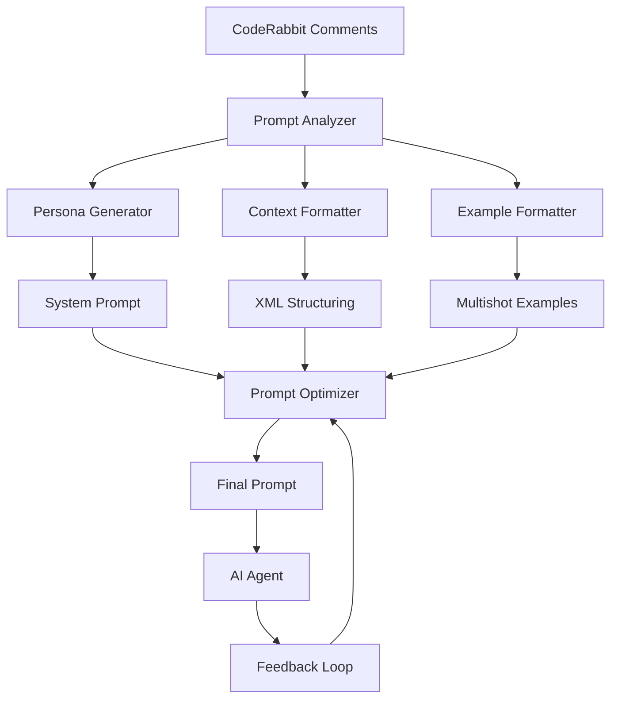

# AIエージェント用指示プロンプト仕様書

## 概要

CodeRabbit Comment Fetcherが生成するAIエージェント用指示プロンプトは、[Claude プロンプトエンジニアリングのベストプラクティス](https://docs.claude.com/en/docs/build-with-claude/prompt-engineering/overview.md)に従い、明確で構造化された指示を提供する。これにより、取得したCodeRabbitコメントに対する適切な対応と修正提案を促進する。

## 設計原則

### 1. Claude 4 ベストプラクティス準拠

本仕様は以下のClaude プロンプトエンジニアリング技法を統合的に活用する：

- **明確で直接的な指示** (Be clear and direct)
- **マルチショット例示** (Use examples - multishot)
- **思考連鎖誘導** (Let Claude think - chain of thought)
- **XMLタグ構造化** (Use XML tags)
- **役割付与** (Give Claude a role - system prompts)
- **レスポンス事前埋め込み** (Prefill Claude's response)

### 2. 段階的品質向上戦略

プロンプトエンジニアリングは以下の順序で適用される：

1. **基本構造確立** → 明確な役割定義と具体的タスク
2. **例示強化** → マルチショット学習による理解促進
3. **思考プロセス誘導** → 段階的分析の促進
4. **構造化** → XMLタグによる情報整理
5. **専門性付与** → システムプロンプトによる役割強化
6. **出力制御** → プリフィル機能による一貫性確保

## アーキテクチャ

### コンポーネント関係図



## 実装仕様

### 1. システムプロンプト生成

#### PersonaManager クラス拡張

```python
class PersonaManager:
    def __init__(self):
        self.default_persona_generator = ClaudeOptimizedPersonaGenerator()
        self.prompt_validator = PromptValidator()

    def generate_claude_optimized_persona(self) -> str:
        """Claude 4最適化されたシステムプロンプト生成"""
        return self._build_structured_persona()

    def _build_structured_persona(self) -> str:
        """構造化されたペルソナ作成"""
        return f"""
<role>
あなたは10年以上の経験を持つシニアソフトウェアエンジニアです。

専門分野:
- コードレビューと品質改善
- セキュリティ脆弱性の特定と修正
- パフォーマンス最適化
- アーキテクチャ設計とリファクタリング
- テスト戦略とCI/CD改善
</role>

<core_principles>
1. コードの品質、保守性、可読性を最優先する
2. セキュリティとパフォーマンスを常に考慮する
3. ベストプラクティスと業界標準に従う
4. 具体的で実装可能な解決策を提示する
5. 変更による影響範囲を明確に説明する
</core_principles>

<analysis_methodology>
問題分析時は以下の段階的アプローチを使用してください:

1. **問題の理解**: コメントの本質的な課題を特定
2. **影響範囲の評価**: 修正が他の部分に与える影響を分析
3. **解決策の検討**: 複数のアプローチを比較検討
4. **実装戦略**: 具体的な修正手順を策定
5. **検証方法**: テストとレビューの方針を提案
</analysis_methodology>

<output_requirements>
各CodeRabbitコメントに対して以下の構造で回答してください:

## [ファイル名:行番号] 問題タイトル

### 問題分析
- **根本原因**: 何が本質的な問題なのか
- **影響度**: 現状の問題による影響の大きさ
- **緊急度**: 修正の優先度

### 修正提案
```language
// 修正前
[現在のコード]

// 修正後
[提案するコード]
```

### 実装ガイド
- [ ] 具体的な修正手順1
- [ ] 具体的な修正手順2
- [ ] テスト方法
- [ ] 関連部分への影響確認

### 優先度判定
**[緊急/重要/推奨]** - [判定理由]
</output_requirements>
"""

class ClaudeOptimizedPersonaGenerator:
    """Claude 4ベストプラクティスに基づくペルソナ生成器"""

    def generate(self) -> str:
        """デフォルトペルソナの生成"""
        base_persona = self._create_base_persona()
        examples = self._create_multishot_examples()
        thinking_framework = self._create_thinking_framework()

        return f"{base_persona}\n\n{examples}\n\n{thinking_framework}"

    def _create_base_persona(self) -> str:
        """基本ペルソナ定義"""
        return """
あなたは経験豊富なソフトウェア開発者です。CodeRabbitのレビューコメントを分析し、適切な修正提案を行うことが主要な任務です。

## あなたの専門性
- 多言語プログラミング（Python, JavaScript, Java, Go, C++ など）
- ソフトウェアアーキテクチャ設計
- セキュリティベストプラクティス
- パフォーマンス最適化
- テスト駆動開発
"""

    def _create_multishot_examples(self) -> str:
        """マルチショット例示の作成"""
        return """
## 分析例示

### 例1: セキュリティ問題

**入力例**:
ファイル: `auth.py:45-50`
問題: SQLインジェクション脆弱性の可能性

**期待される分析**:

#### 問題分析
- **根本原因**: ユーザー入力が直接SQL文に連結されている
- **影響度**: 高（データベース全体への不正アクセス可能）
- **緊急度**: 緊急（セキュリティ脆弱性）

#### 修正提案
```python
# 修正前
query = f"SELECT * FROM users WHERE id = {user_id}"
cursor.execute(query)

# 修正後
query = "SELECT * FROM users WHERE id = %s"
cursor.execute(query, (user_id,))
```

#### 実装ガイド
- [ ] パラメータ化クエリに変更
- [ ] 入力値のバリデーション追加
- [ ] セキュリティテストケース作成
- [ ] 他の類似箇所の確認

#### 優先度判定
**緊急** - セキュリティ脆弱性は即座に修正が必要

---

### 例2: パフォーマンス問題

**入力例**:
ファイル: `data_processor.py:120-125`
問題: ループ内でのO(n²)処理

**期待される分析**:

#### 問題分析
- **根本原因**: ネストしたループによる非効率なアルゴリズム
- **影響度**: 中（大量データ処理時のパフォーマンス劣化）
- **緊急度**: 重要（処理速度に影響）

#### 修正提案
```python
# 修正前
for item in items:
    for target in targets:
        if item.id == target.id:
            process(item, target)

# 修正後
target_dict = {target.id: target for target in targets}
for item in items:
    if item.id in target_dict:
        process(item, target_dict[item.id])
```

#### 実装ガイド
- [ ] 辞書を使用したO(1)ルックアップに変更
- [ ] パフォーマンステスト追加
- [ ] メモリ使用量の確認
- [ ] 大量データでの動作検証

#### 優先度判定
**重要** - パフォーマンス改善により処理効率が大幅向上
"""

    def _create_thinking_framework(self) -> str:
        """思考フレームワークの定義"""
        return """
## 分析フレームワーク

各コメントを分析する際は、以下の思考プロセスに従ってください:

### ステップ1: 初期理解
- このコメントは何を指摘しているのか？
- CodeRabbitが懸念している具体的な問題は何か？
- 対象となるコードの目的と文脈は何か？

### ステップ2: 深度分析
- なぜこの問題が発生したのか？（根本原因）
- この問題を放置した場合の影響は？
- 修正の複雑さはどの程度か？

### ステップ3: 解決策検討
- 最も効果的な修正方法は何か？
- 代替案はあるか？
- 修正による副作用はあるか？

### ステップ4: 実装計画
- 具体的な修正手順は？
- 必要なテストは何か？
- 関連する他の部分への影響は？

### ステップ5: 優先度判定
- セキュリティ問題？ → 緊急
- 機能停止の可能性？ → 緊急
- パフォーマンス問題？ → 重要
- コード品質改善？ → 推奨
"""
```

### 2. AIエージェントプロンプト特別処理

#### ReviewProcessor クラス拡張

```python
class ReviewProcessor:
    def __init__(self):
        self.ai_prompt_extractor = AIPromptExtractor()
        self.context_builder = ContextBuilder()

    def extract_ai_agent_prompts(self, content: str) -> List[AIAgentPrompt]:
        """🤖 Prompt for AI Agentsセクションの特別処理"""
        return self.ai_prompt_extractor.extract_with_context(content)

    def format_for_claude_consumption(self, prompt: AIAgentPrompt) -> str:
        """Claude最適化されたAIエージェントプロンプト"""
        return f"""
<ai_agent_task>
    <context>
        <problem_description>
            {prompt.description}
        </problem_description>

        <coderabbit_suggestion>
            CodeRabbitは以下のコード修正を提案しています:
        </coderabbit_suggestion>
    </context>

    <suggested_implementation language="{prompt.language}">
{prompt.code_block}
    </suggested_implementation>

    <analysis_requirements>
        上記のCodeRabbit提案について、以下の観点から分析してください:

        1. **コードの正確性**
           - 提案されたコードは文法的に正しいか？
           - 期待される動作を実現できるか？

        2. **実装の適切性**
           - 既存のコードベースとの整合性は？
           - アーキテクチャ原則に従っているか？

        3. **潜在的な問題**
           - パフォーマンスへの影響は？
           - セキュリティ上の懸念はないか？
           - エラーハンドリングは適切か？

        4. **改善提案**
           - より良い実装方法があるか？
           - 追加で考慮すべき点はあるか？

        5. **実装ガイダンス**
           - 実装時の注意点は？
           - 必要なテストケースは？
           - 段階的な実装手順は？
    </analysis_requirements>

    <output_format>
        以下の形式で回答してください:

        ## CodeRabbit提案の評価

        ### ✅ 良い点
        - [具体的な良い点1]
        - [具体的な良い点2]

        ### ⚠️ 懸念点
        - [潜在的な問題1]
        - [潜在的な問題2]

        ### 🔧 改善提案
        ```{prompt.language}
        // より最適化された実装案
        [改善されたコード]
        ```

        ### 📋 実装チェックリスト
        - [ ] [実装ステップ1]
        - [ ] [実装ステップ2]
        - [ ] [テスト項目1]
        - [ ] [テスト項目2]
    </output_format>
</ai_agent_task>
"""

class AIPromptExtractor:
    """AI Agent Prompt専用抽出器"""

    def extract_with_context(self, content: str) -> List[AIAgentPrompt]:
        """コンテキストを含むAIプロンプト抽出"""
        prompts = []

        # 🤖 Prompt for AI Agentsセクションを検索
        pattern = r'🤖 Prompt for AI Agents\n\n```(\w+)\n(.*?)\n```'
        matches = re.findall(pattern, content, re.DOTALL | re.MULTILINE)

        for language, code in matches:
            context = self._extract_surrounding_context(content, code)

            prompts.append(AIAgentPrompt(
                code_block=code.strip(),
                language=language,
                description=context,
                extraction_metadata=self._create_metadata(content, code)
            ))

        return prompts

    def _extract_surrounding_context(self, content: str, code_block: str) -> str:
        """コードブロック周辺のコンテキスト抽出"""
        # コードブロック前後の文脈を抽出
        lines = content.split('\n')
        code_lines = code_block.split('\n')

        # コードブロックの位置を特定
        for i, line in enumerate(lines):
            if code_lines[0].strip() in line:
                # 前後3-5行のコンテキストを抽出
                start = max(0, i - 5)
                end = min(len(lines), i + len(code_lines) + 5)
                context_lines = lines[start:i]
                break

        # 関連する問題説明を抽出
        context_text = '\n'.join(context_lines)
        return self._clean_context_text(context_text)

    def _create_metadata(self, content: str, code: str) -> Dict:
        """抽出メタデータの作成"""
        return {
            'extraction_timestamp': datetime.now().isoformat(),
            'content_length': len(content),
            'code_length': len(code),
            'has_security_keywords': self._check_security_keywords(content),
            'has_performance_keywords': self._check_performance_keywords(content),
            'complexity_estimate': self._estimate_complexity(code)
        }
```

### 3. スレッドコンテキスト構造化

#### ThreadProcessor クラス拡張

```python
class ThreadProcessor:
    def __init__(self):
        self.context_analyzer = ThreadContextAnalyzer()
        self.xml_formatter = XMLContextFormatter()

    def build_claude_optimized_context(self, comments: List[Dict]) -> str:
        """Claude最適化されたスレッドコンテキスト"""
        context = self.context_analyzer.analyze_thread_structure(comments)
        return self.xml_formatter.format_for_claude(context)

class ThreadContextAnalyzer:
    """スレッドコンテキスト分析器"""

    def analyze_thread_structure(self, comments: List[Dict]) -> ThreadContext:
        """スレッド構造の詳細分析"""
        coderabbit_comments = self._filter_coderabbit_comments(comments)

        return ThreadContext(
            main_comment=self._identify_main_comment(coderabbit_comments),
            replies=self._extract_replies(coderabbit_comments),
            resolution_status=self._determine_resolution_status(coderabbit_comments),
            technical_focus=self._extract_technical_focus(coderabbit_comments),
            discussion_evolution=self._track_discussion_evolution(coderabbit_comments),
            unresolved_points=self._identify_unresolved_points(coderabbit_comments)
        )

    def _extract_technical_focus(self, comments: List[Dict]) -> List[str]:
        """技術的焦点の抽出"""
        focus_areas = []

        focus_keywords = {
            'security': ['security', 'vulnerability', 'injection', 'xss', 'csrf'],
            'performance': ['performance', 'optimization', 'slow', 'memory', 'cpu'],
            'maintainability': ['maintainability', 'readable', 'clean', 'refactor'],
            'testing': ['test', 'coverage', 'mock', 'assertion', 'validate'],
            'architecture': ['architecture', 'design', 'pattern', 'coupling', 'cohesion']
        }

        for comment in comments:
            content = comment.get('body', '').lower()
            for category, keywords in focus_keywords.items():
                if any(keyword in content for keyword in keywords):
                    if category not in focus_areas:
                        focus_areas.append(category)

        return focus_areas

    def _track_discussion_evolution(self, comments: List[Dict]) -> List[Dict]:
        """議論の発展過程追跡"""
        evolution = []

        for i, comment in enumerate(comments):
            evolution.append({
                'sequence': i + 1,
                'timestamp': comment.get('created_at'),
                'content_summary': self._summarize_comment(comment.get('body', '')),
                'change_type': self._classify_comment_type(comment),
                'introduces_new_concern': self._introduces_new_concern(comment, comments[:i]),
                'addresses_previous_point': self._addresses_previous_point(comment, comments[:i])
            })

        return evolution

class XMLContextFormatter:
    """XMLベースのコンテキストフォーマッター"""

    def format_for_claude(self, context: ThreadContext) -> str:
        """Claude最適化されたXML形式出力"""
        return f"""
<thread_analysis>
    <conversation_metadata>
        <participant_count>{len(set(c.get('user', {}).get('login') for c in context.all_comments))}</participant_count>
        <coderabbit_comment_count>{len(context.coderabbit_comments)}</coderabbit_comment_count>
        <time_span>{self._calculate_time_span(context)}</time_span>
        <resolution_status>{context.resolution_status}</resolution_status>
    </conversation_metadata>

    <technical_focus_areas>
        {self._format_focus_areas(context.technical_focus)}
    </technical_focus_areas>

    <discussion_flow>
        <main_concern>
            <author>coderabbitai</author>
            <timestamp>{context.main_comment.get('created_at')}</timestamp>
            <content_summary>{self._extract_main_concern(context.main_comment)}</content_summary>
            <full_content>
                <![CDATA[{context.main_comment.get('body', '')}]]>
            </full_content>
        </main_concern>

        <conversation_evolution>
            {self._format_discussion_evolution(context.discussion_evolution)}
        </conversation_evolution>

        <unresolved_points>
            {self._format_unresolved_points(context.unresolved_points)}
        </unresolved_points>
    </discussion_flow>

    <ai_analysis_guidance>
        <primary_task>
            このスレッドの技術的議論を分析し、以下の観点から包括的な回答を提供してください:
        </primary_task>

        <analysis_dimensions>
            <technical_accuracy>
                議論されている技術的内容の正確性を評価してください
            </technical_accuracy>

            <implementation_feasibility>
                提案された解決策の実装可能性を検討してください
            </implementation_feasibility>

            <impact_assessment>
                修正による既存システムへの影響を分析してください
            </impact_assessment>

            <best_practices_alignment>
                業界のベストプラクティスとの整合性を確認してください
            </best_practices_alignment>
        </analysis_dimensions>

        <context_considerations>
            <discussion_history>
                これまでの議論の流れと各参加者の懸念点を考慮してください
            </discussion_history>

            <technical_constraints>
                技術的制約や既存アーキテクチャとの整合性を重視してください
            </technical_constraints>

            <evolution_patterns>
                議論がどのように発展してきたかのパターンを理解してください
            </evolution_patterns>
        </context_considerations>

        <expected_output_structure>
            ## スレッド分析結果

            ### 技術的議論の要約
            [議論の核心となる技術的問題の要約]

            ### 提案された解決策の評価
            [各解決策の長所・短所・実装コスト]

            ### 推奨アプローチ
            [最適と判断される解決策とその理由]

            ### 実装ガイドライン
            [具体的な実装手順と注意点]

            ### リスク分析
            [実装時に考慮すべきリスクと軽減策]
        </expected_output_structure>
    </ai_analysis_guidance>
</thread_analysis>
"""

    def _format_focus_areas(self, focus_areas: List[str]) -> str:
        """技術的焦点領域のフォーマット"""
        if not focus_areas:
            return "<focus_area>general_code_quality</focus_area>"

        return '\n        '.join(f"<focus_area>{area}</focus_area>" for area in focus_areas)

    def _format_discussion_evolution(self, evolution: List[Dict]) -> str:
        """議論発展過程のフォーマット"""
        evolution_xml = ""
        for step in evolution:
            evolution_xml += f"""
            <discussion_step sequence="{step['sequence']}">
                <timestamp>{step['timestamp']}</timestamp>
                <content_summary>{step['content_summary']}</content_summary>
                <change_type>{step['change_type']}</change_type>
                <introduces_new_concern>{step['introduces_new_concern']}</introduces_new_concern>
                <addresses_previous_point>{step['addresses_previous_point']}</addresses_previous_point>
            </discussion_step>"""

        return evolution_xml
```

### 4. 出力フォーマット最適化

#### プリフィル機能実装

```python
class MarkdownFormatter(BaseFormatter):
    def __init__(self):
        self.prefill_generator = PrefillGenerator()
        self.structure_optimizer = StructureOptimizer()

    def format_with_claude_prefill(self, persona: str, analyzed_comments: AnalyzedComments) -> str:
        """プリフィル機能を活用したClaude最適化出力"""

        # プリフィル構造の生成
        prefill_structure = self.prefill_generator.create_response_structure(analyzed_comments)

        # メイン出力の生成
        main_content = self._format_main_content(persona, analyzed_comments)

        # 統合出力
        return f"{main_content}\n\n{prefill_structure}"

    def _format_main_content(self, persona: str, analyzed_comments: AnalyzedComments) -> str:
        """メインコンテンツの構造化フォーマット"""
        return f"""
{persona}

# CodeRabbitレビュー分析タスク

## 分析対象サマリー
- **総コメント数**: {self._count_total_comments(analyzed_comments)}
- **アクション要求コメント**: {self._count_actionable_comments(analyzed_comments)}
- **未解決スレッド**: {len(analyzed_comments.unresolved_threads)}
- **AIエージェント専用プロンプト**: {self._count_ai_prompts(analyzed_comments)}

## 分析要求事項

### 🎯 主要タスク
各CodeRabbitコメントについて、以下の構造化された分析を実行してください:

1. **問題の本質理解** - なぜCodeRabbitがこの問題を指摘したのか
2. **影響範囲評価** - 修正による他部分への影響
3. **解決策提案** - 具体的で実装可能な修正案
4. **優先度判定** - 緊急度と重要度に基づく優先順位
5. **実装ガイダンス** - 段階的な実装手順とテスト方針

### 📋 出力形式要求

各コメントに対して以下の統一フォーマットで回答してください:

```
## [ファイル名:行番号] 問題タイトル

### 🔍 問題分析
**根本原因**: [問題の本質]
**影響度**: [高/中/低] - [影響範囲の説明]
**技術的背景**: [関連する技術的コンテキスト]

### 💡 解決策提案
#### 推奨アプローチ
```language
// 修正前
[現在の問題のあるコード]

// 修正後
[提案する改善されたコード]
```

#### 代替案 (該当する場合)
- **選択肢1**: [代替実装方法1]
- **選択肢2**: [代替実装方法2]

### 📋 実装ガイドライン
- [ ] **ステップ1**: [具体的な実装手順]
- [ ] **ステップ2**: [具体的な実装手順]
- [ ] **テスト**: [必要なテスト内容]
- [ ] **影響確認**: [確認すべき関連部分]

### ⚡ 優先度評価
**判定**: [緊急/重要/推奨]
**理由**: [優先度判定の根拠]
**期限目安**: [修正すべき時期の目安]
```

## 特別な処理要求

### 🤖 AIエージェント専用プロンプト
CodeRabbitが「🤖 Prompt for AI Agents」として提供するコードブロックについては、以下の特別な分析を実行してください:

1. **提案コードの検証** - 文法的正確性と論理的妥当性
2. **実装適合性評価** - 既存コードベースとの整合性
3. **最適化提案** - より良い実装があるかの検討
4. **実装リスク評価** - 潜在的な問題点の特定

### 🧵 スレッドコンテキスト分析
複数のやり取りがあるコメントスレッドについては:

1. **議論の経緯理解** - 過去のやり取りを考慮
2. **未解決ポイント特定** - まだ解決されていない課題
3. **総合的解決策** - スレッド全体を考慮した包括的な提案

---

# 分析開始

以下のCodeRabbitコメントから順次分析を開始してください:

{self._format_comments_for_analysis(analyzed_comments)}
"""

class PrefillGenerator:
    """プリフィル生成器"""

    def create_response_structure(self, analyzed_comments: AnalyzedComments) -> str:
        """レスポンス構造のプリフィル生成"""
        comment_count = self._count_total_actionable_comments(analyzed_comments)

        prefill_structure = "# CodeRabbitレビュー分析結果\n\n"

        # 各コメントのプリフィル構造を生成
        for i, comment in enumerate(self._get_actionable_comments(analyzed_comments), 1):
            file_info = self._extract_file_info(comment)
            prefill_structure += f"""
## [{file_info}]

### 🔍 問題分析
**根本原因**:
**影響度**:
**技術的背景**:

### 💡 解決策提案
#### 推奨アプローチ
```
// 分析中...
```

### 📋 実装ガイドライン
- [ ]
- [ ]
- [ ]

### ⚡ 優先度評価
**判定**:
**理由**:

---

"""

        return prefill_structure
```

### 5. プロンプト品質保証

#### バリデーション機能

```python
class PromptValidator:
    """プロンプト品質バリデーター"""

    def __init__(self):
        self.claude_best_practices = ClaudeBestPracticesChecker()
        self.structure_validator = StructureValidator()
        self.content_analyzer = ContentAnalyzer()

    def validate_claude_compliance(self, prompt: str) -> ValidationResult:
        """Claude 4ベストプラクティス準拠チェック"""

        checks = {
            'clear_role_definition': self._has_clear_role_definition(prompt),
            'specific_instructions': self._has_specific_instructions(prompt),
            'structured_format': self._has_structured_format(prompt),
            'xml_tags_usage': self._uses_xml_tags_appropriately(prompt),
            'examples_provided': self._provides_examples(prompt),
            'thinking_guidance': self._includes_thinking_guidance(prompt),
            'output_format_specified': self._specifies_output_format(prompt)
        }

        score = sum(checks.values()) / len(checks) * 100

        return ValidationResult(
            overall_score=score,
            individual_checks=checks,
            recommendations=self._generate_recommendations(checks),
            compliance_level=self._determine_compliance_level(score)
        )

    def _has_clear_role_definition(self, prompt: str) -> bool:
        """明確な役割定義の有無チェック"""
        role_indicators = [
            'あなたは',
            '<role>',
            'エンジニア',
            '開発者',
            '専門家',
            'あなたの専門性'
        ]
        return any(indicator in prompt for indicator in role_indicators)

    def _has_specific_instructions(self, prompt: str) -> bool:
        """具体的な指示の有無チェック"""
        instruction_patterns = [
            r'以下の.*を.*してください',
            r'各.*について.*分析',
            r'ステップ\d+',
            r'- \[.*\]',
            'チェックリスト',
            '実装ガイド'
        ]
        return any(re.search(pattern, prompt) for pattern in instruction_patterns)

    def _uses_xml_tags_appropriately(self, prompt: str) -> bool:
        """XMLタグの適切な使用チェック"""
        xml_patterns = [
            r'<\w+>.*</\w+>',
            r'<role>',
            r'<instructions>',
            r'<output_format>',
            r'<analysis_requirements>'
        ]
        return any(re.search(pattern, prompt, re.DOTALL) for pattern in xml_patterns)

    def _provides_examples(self, prompt: str) -> bool:
        """例示の提供チェック"""
        example_indicators = [
            '例:',
            '例示',
            '入力例',
            '期待される',
            '## 例',
            'サンプル'
        ]
        return any(indicator in prompt for indicator in example_indicators)

class PerformanceOptimizer:
    """プロンプトパフォーマンス最適化器"""

    def optimize_for_token_efficiency(self, prompt: str) -> str:
        """トークン効率の最適化"""
        # 冗長な表現の削除
        optimized = self._remove_redundant_phrases(prompt)

        # 構造の最適化
        optimized = self._optimize_structure(optimized)

        # 重要度に基づく内容の優先順位付け
        optimized = self._prioritize_content(optimized)

        return optimized

    def optimize_for_response_quality(self, prompt: str, feedback_data: Dict) -> str:
        """レスポンス品質に基づく最適化"""
        # フィードバックデータに基づく改善
        if feedback_data.get('unclear_instructions'):
            prompt = self._clarify_instructions(prompt)

        if feedback_data.get('incomplete_responses'):
            prompt = self._add_completion_guidance(prompt)

        if feedback_data.get('inconsistent_format'):
            prompt = self._strengthen_format_requirements(prompt)

        return prompt

@dataclass
class ValidationResult:
    overall_score: float
    individual_checks: Dict[str, bool]
    recommendations: List[str]
    compliance_level: str  # 'excellent', 'good', 'needs_improvement', 'poor'
```

## 設定とデプロイメント

### 設定ファイル

```python
# config/prompt_config.py
CLAUDE_PROMPT_CONFIG = {
    'max_token_length': 200000,  # Claude 4の制限に合わせる
    'temperature': 0.1,  # 一貫性を重視
    'response_format': 'structured_markdown',

    'validation_rules': {
        'min_role_definition_length': 50,
        'required_xml_tags': ['role', 'instructions', 'output_format'],
        'min_example_count': 2,
        'max_prompt_complexity': 0.8
    },

    'optimization_settings': {
        'enable_token_optimization': True,
        'enable_structure_optimization': True,
        'enable_performance_feedback': True,
        'auto_improvement_cycle': True
    },

    'quality_gates': {
        'min_compliance_score': 80,
        'required_components': [
            'clear_role', 'specific_task', 'examples',
            'thinking_guidance', 'output_format'
        ]
    }
}
```

### 使用例

```python
# 使用例
from coderabbit_fetcher.prompt import ClaudeOptimizedPromptGenerator

# プロンプト生成器の初期化
generator = ClaudeOptimizedPromptGenerator()

# CodeRabbitコメントからプロンプト生成
analyzed_comments = analyzer.analyze_comments(raw_comments)
optimized_prompt = generator.generate_claude_prompt(
    persona_file=None,  # デフォルトペルソナを使用
    analyzed_comments=analyzed_comments,
    optimization_level='high'
)

# 品質検証
validator = PromptValidator()
validation_result = validator.validate_claude_compliance(optimized_prompt)

if validation_result.compliance_level in ['excellent', 'good']:
    print(optimized_prompt)
else:
    # 改善提案に基づいて最適化
    improved_prompt = generator.improve_prompt(
        optimized_prompt,
        validation_result.recommendations
    )
    print(improved_prompt)
```

## 継続的改善

### A/Bテスト機能

```python
class PromptABTester:
    """プロンプトA/Bテスト実行器"""

    def run_ab_test(self, prompt_a: str, prompt_b: str, test_data: List[Dict]) -> ABTestResult:
        """A/Bテストの実行"""
        results_a = self._evaluate_prompt(prompt_a, test_data)
        results_b = self._evaluate_prompt(prompt_b, test_data)

        return ABTestResult(
            prompt_a_performance=results_a,
            prompt_b_performance=results_b,
            statistical_significance=self._calculate_significance(results_a, results_b),
            recommendation=self._generate_recommendation(results_a, results_b)
        )
```

### フィードバックループ

```python
class FeedbackCollector:
    """フィードバック収集器"""

    def collect_response_quality_metrics(self, prompt: str, response: str, user_satisfaction: float) -> None:
        """レスポンス品質メトリクスの収集"""
        metrics = {
            'prompt_clarity': self._assess_prompt_clarity(prompt),
            'response_completeness': self._assess_completeness(response),
            'response_accuracy': self._assess_accuracy(response),
            'user_satisfaction': user_satisfaction,
            'token_efficiency': self._calculate_token_efficiency(prompt, response)
        }

        self._store_metrics(metrics)
        self._trigger_improvement_cycle(metrics)
```

## まとめ

この仕様は、[Claude プロンプトエンジニアリングのベストプラクティス](https://docs.claude.com/en/docs/build-with-claude/prompt-engineering/overview.md)に基づいて以下の技法を統合実装します:

### 実装済みベストプラクティス

1. **明確で直接的な指示**: 具体的なタスク定義と期待される出力の明示
2. **マルチショット例示**: 複数の実例によるパターン学習の促進
3. **思考連鎖誘導**: 段階的分析プロセスの明確な提示
4. **XMLタグ構造化**: 情報の論理的整理と処理効率向上
5. **役割付与**: システムプロンプトによる専門性と文脈の確立
6. **レスポンス事前埋め込み**: 一貫した出力形式の確保

### 品質保証機能

- **リアルタイム検証**: プロンプト生成時の品質チェック
- **継続的改善**: フィードバックに基づく自動最適化
- **A/Bテスト**: 異なるアプローチの効果測定
- **パフォーマンス最適化**: トークン効率と応答品質の両立

これにより、CodeRabbitコメントに対する正確で実装可能で一貫した修正提案を生成できるAIエージェント指示プロンプトシステムを実現します。

