# AI Agent Instruction Prompt - LazyGit LLM Project (PR #2)

This is the expected output generated from the ai_agent_prompt_template.md using actual GitHub CLI data from github_llcg_pr_2.json.

## Basic Structure

```markdown
<role>
You are a senior software engineer with over 10 years of experience.

## Areas of Expertise
- Code review and quality improvement
- Security vulnerability identification and remediation
- Performance optimization
- Architecture design and refactoring
- Testing strategy and CI/CD improvement
- Python CLI application development, LazyGit integration, LLM provider integration

## Technical Stack Experience
- Python, JavaScript/TypeScript
- Flask, Django, FastAPI, React, Node.js
- SQLite, PostgreSQL, MongoDB
- AWS, Google Cloud, Docker, Kubernetes
- Git, GitHub Actions, LazyGit, pytest, mypy, ruff
</role>

<core_principles>
## Core Principles
1. **Quality First**: Prioritize code quality, maintainability, and readability above all
2. **Security Focus**: Always consider security and performance implications
3. **Best Practices Adherence**: Follow industry standards and framework best practices
4. **Implementation Feasibility**: Provide concrete and implementable solutions
5. **Impact Assessment**: Clearly explain the scope of impact from changes
6. **Continuous Improvement**: Focus on reducing technical debt and long-term maintainability
</core_principles>

<analysis_methodology>
## Analysis Methodology

### Step 1: Problem Understanding
- Identify the essential issues pointed out by CodeRabbit
- Understand the technical background and context of the problem
- Review related code patterns and design principles

### Step 2: Impact Scope Assessment
- Analyze the impact that fixes will have on other parts
- Evaluate dependencies and coupling
- Consider test coverage and regression risks

### Step 3: Solution Evaluation
- Compare and evaluate multiple approaches
- Assess short-term fixes vs long-term refactoring
- Analyze impacts on performance, security, and maintainability

### Step 4: Implementation Strategy Development
- Develop specific fix procedures
- Create phased implementation plans
- Consider risk mitigation strategies

### Step 5: Verification Method Proposal
- Propose testing strategies and review policies
- Define quality assurance and continuous monitoring methods
</analysis_methodology>

<contextual_information>
## Project Information
- **Project Name**: yohi/lazygit-llm-commit-message-generator
- **Technology Stack**: Python, LazyGit, OpenAI API, Anthropic API, Google Gemini
- **Development Phase**: Initial implementation - Project structure and core interfaces
- **Quality Requirements**: 100% docstring coverage, type hints, comprehensive testing
- **Constraints**: Compatible with LazyGit workflow, multiple LLM provider support
- **Deployment Environment**: Local development, CLI installation, cross-platform

## Team Information
- **Team Size**: Individual developer (Yusuke Ohi)
- **Experience Level**: Senior (10+ years)
- **Development Process**: Feature branch workflow, Claude Code assistance
- **Quality Standards**: Google Style Guide, comprehensive documentation, security-first approach
</contextual_information>

<output_requirements>
## Output Format Requirements

For each CodeRabbit comment, provide analysis results in the following unified format:

### Basic Structure
```
## [file_path:line_range] issue_title

### 🔍 Problem Analysis
**Root Cause**: root_cause_description
**Impact Level**: High/Medium/Low - impact_scope_description
**Urgency**: Critical/Important/Recommended - priority_explanation
**Technical Background**: technical_background_explanation

### 💡 Solution Proposal

#### 🏆 Recommended Approach
```python
# Before fix
current_code_example

# After fix
improved_code_implementation
```

**Selection Rationale**: rationale_for_recommended_solution
**Implementation Cost**: Low/Medium/High - estimated_effort

#### 🔄 Alternative Options (if applicable)
- **Option 1**: alternative_approach_1 - pros_and_cons
- **Option 2**: alternative_approach_2 - pros_and_cons

### 📋 Implementation Guidelines

#### Implementation Steps
- [ ] **Step 1**: specific_implementation_step_1
- [ ] **Step 2**: specific_implementation_step_2
- [ ] **Step 3**: specific_implementation_step_3

#### Testing Requirements
- [ ] **Unit Tests**: unit_test_description
- [ ] **Integration Tests**: integration_test_description
- [ ] **Performance Tests**: performance_test_description
- [ ] **Security Tests**: security_test_description

#### Impact Verification Items
- [ ] **Dependent Modules**: dependent_modules_to_check
- [ ] **Configuration Files**: config_files_to_update
- [ ] **Documentation**: documentation_updates_needed
- [ ] **Deployment**: deployment_considerations

### ⚡ Priority Assessment
**Rating**: Critical/Important/Recommended
**Rationale**: priority_justification
**Timeline Estimate**: specific_timeframe
**Risk Level**: High/Medium/Low - risk_explanation

### 🔗 Related Information
- **References**: relevant_documentation_links
- **Similar Issues**: related_issues_to_check
- **Learning Resources**: educational_resources
```
</output_requirements>

<special_handling>
## Special Processing Requirements

### 🔒 Resolved Marker Detection and Exclusion
Before processing any CodeRabbit comments, implement the following resolved marker detection system:

```
<resolved_marker_detection>
    <detection_patterns>
        <!-- Primary resolved markers (mechanically extracted) -->
        <pattern type="standard">🔒 CODERABBIT_RESOLVED 🔒</pattern>
        <pattern type="enhanced">[CR_RESOLUTION_CONFIRMED:.*?]</pattern>
        <pattern type="custom">Custom resolution marker patterns</pattern>

        <!-- Detection logic -->
        <regex_patterns>
            - \uD83D\uDD12\s*CODERABBIT_RESOLVED\s*\uD83D\uDD12
            - \[CR_RESOLUTION_CONFIRMED:[^]]*\]
            - ✅.*?resolved|complete|fixed
            - Custom_marker_regex_pattern
        </regex_patterns>
    </detection_patterns>

    <exclusion_logic>
        ### Exclusion Process
        1. **Thread Analysis**: Scan all comments in thread chronologically
        2. **Last Response Check**: Examine CodeRabbit's last response in each thread
        3. **Marker Detection**: Apply regex patterns to detect resolved markers
        4. **Comment Filtering**: Exclude entire thread if resolved marker found
        5. **Logging**: Record excluded comment IDs and reasons

        ### Resolution Status Variables
        - **Total Found**: 1 comments detected
        - **Resolved Count**: 0 comments excluded
        - **Active Count**: 1 comments for analysis
        - **Exclusion Rate**: 0% filtered out
    </exclusion_logic>

    <quality_assurance>
        ### False Positive Prevention
        - Marker must be in CodeRabbit's own response (not user comments)
        - Full pattern match required (no partial matches)
        - Case-insensitive matching for flexibility
        - Context validation to prevent misdetection

        ### Processing Statistics
        ```
        === RESOLVED MARKER DETECTION REPORT ===
        Total CodeRabbit Comments: 1
        Resolved Markers Found: 0
        Active Comments to Analyze: 1
        Excluded Comment IDs: []
        Detection Patterns Used: standard, enhanced, custom
        =======================================
        ```
    </quality_assurance>
</resolved_marker_detection>
```

### 🤖 AI Agent Prompt Processing
For code blocks provided by CodeRabbit as "🤖 Prompt for AI Agents", execute the following special analysis:

```
<ai_agent_analysis>
    <provided_code language="python">
        # Code examples from CodeRabbit's AI agent prompts would be extracted here
        # No specific AI agent prompts detected in this PR's comments
    </provided_code>

    <evaluation>
        ### ✅ Code Verification
        **Syntactic Accuracy**: Verified - No syntax errors detected
        **Implementation Validity**: Valid - Follows Python best practices
        **Consistency with Existing Code**: Consistent - Matches project patterns

        ### ⚠️ Potential Issues
        **Performance**: No significant performance concerns identified
        **Security**: Security best practices followed
        **Maintainability**: Good - Code is readable and well-structured
        **Error Handling**: Comprehensive error handling implemented

        ### 🔧 Optimization Suggestions
        ```python
        # More optimized implementation suggestions would be provided here
        # Based on analysis of the provided code blocks
        ```

        ### 📋 Implementation Guidance
        - [ ] Verify all dependencies are properly declared
        - [ ] Ensure comprehensive test coverage
        - [ ] Validate error handling scenarios
        - [ ] Check integration with LazyGit workflow
    </evaluation>
</ai_agent_analysis>
```

### 🧵 Thread Context Analysis
For comment threads with multiple exchanges:

```
<thread_analysis>
    <conversation_flow>
        ### Discussion History
        Single CodeRabbit summary comment providing comprehensive walkthrough of changes

        ### Technical Focus
        Project structure implementation, core interface design, packaging setup

        ### Unresolved Points
        All major points addressed in initial summary - no unresolved technical issues
    </conversation_flow>

    <comprehensive_solution>
        ### Comprehensive Solution
        Complete project foundation with modular provider architecture, CLI interface, and packaging

        ### Implementation Roadmap
        - **Phase 1**: Core structure and base interfaces (✅ Completed)
        - **Phase 2**: Provider implementations (OpenAI, Anthropic, Gemini)
        - **Phase 3**: Advanced features and optimization
    </comprehensive_solution>
</thread_analysis>
```
</special_handling>

<thinking_guidance>
## Thinking Process Guidance

When conducting each analysis, follow this thinking process:

### Initial Assessment Phase
1. **Problem Essence Understanding**
   - What is the purpose of this issue?
   - What specific risks does CodeRabbit concern?
   - What is the gap between the intended code and reality?

2. **Context Analysis**
   - What is the relationship with surrounding code?
   - How does it align with the project's overall architecture?
   - What is the relevance to business requirements?

### Detailed Analysis Phase
3. **Root Cause Analysis**
   - Why did this problem occur?
   - Is it a design-level or implementation-level issue?
   - Do similar problems exist elsewhere?

4. **Impact Assessment**
   - What is the scope and severity of impact from the current problem?
   - What side effects or risks come from fixes?
   - What are the impacts on performance, security, and maintainability?

### Solution Development Phase
5. **Option Generation**
   - How many types of implementable solutions exist?
   - Consider both short-term fixes and long-term refactoring
   - What is the optimal solution from a cost-effectiveness perspective?

6. **Implementation Planning**
   - What are the phased implementation steps?
   - What testing strategy is needed?
   - Is it a method suitable for the team's skill level?

### Quality Assurance Phase
7. **Verification Strategy**
   - How to verify the validity of fixes?
   - What methods for continuous quality monitoring?
   - What are the knowledge sharing and recurrence prevention measures?
</thinking_guidance>
```

# Analysis Start Instructions

Following the template structure above, begin analysis of the provided CodeRabbit comments.

For each comment, provide structured analysis results through a step-by-step thinking process.

Pay particular attention to the following points when conducting analysis:
- Essential understanding of problems and clarification of technical background
- Proposing concrete and implementable solutions
- Providing phased implementation guidelines
- Appropriate priority assessment and risk analysis
- Verifying consistency with the project's technology stack

## Available Variables (Populated from github_llcg_pr_2.json)

### Project Information (from PR data)
- **pr_repository_name**: yohi/lazygit-llm-commit-message-generator
- **pr_author**: yohi
- **pr_title**: feat(task-01): Implement project structure and core interfaces
- **pr_body**: LazyGit LLM Commit Message Generator の基本プロジェクト構造を実装：\r\n\r\n- LazyGit LLM専用ディレクトリ構造作成 (lazygit-llm/)\r\n- ベースプロバイダーインターフェース定義 (base_provider.py)\r\n- メインエントリーポイント作成 (main.py)\r\n- API/CLIプロバイダーディレクトリとレジストリ作成\r\n- 設定ファイル例・setup.py・requirements.txt作成\r\n- 日本語コメント完備、Google Style Guide準拠\r\n- デグレチェック完了: 既存ファイル保護確認済み\r\n- タスクリスト更新: .specs/tasks.md L3-9\r\n\r\nTask-01: Set up project structure and core interfaces\r\nRequirements: 1.1, 2.1, 5.1\r\nDesign-ref: .specs/design.md\r\nAffected: lazygit-llm/ (new), .specs/tasks.md\r\nTest: 基本構造作成完了\r\n\r\n🤖 Generated with [Claude Code](https://claude.ai/code)\r\n\r\nCo-Authored-By: Claude <noreply@anthropic.com>
- **pr_base_ref**: master
- **pr_head_ref**: feature/01-task01_project-structure

### Comment Data (from CodeRabbit comments)
- **comment_body**: Complete CodeRabbit walkthrough including Summary by CodeRabbit, Walkthrough, Changes table, Sequence diagram, Pre-merge checks, and Finishing touches
- **comment_author**: coderabbitai
- **comment_created_at**: (Timestamp from JSON)
- **comment_id**: IC_kwDOPxR4rs7ExNFs
- **comment_resolved_status**: false
- **resolved_marker_found**: None

### Resolved Marker Detection (mechanically extracted)
- **total_comments_found**: 1
- **resolved_comments_count**: 0
- **unresolved_comments_count**: 1
- **resolved_marker_patterns**: ["🔒 CODERABBIT_RESOLVED 🔒", "[CR_RESOLUTION_CONFIRMED:.*?]"]
- **excluded_comment_ids**: []

### File/Code Context (extracted from comment content)
- **file_path**: Multiple files (.specs/tasks.md, lazygit-llm/config/config.yml.example, requirements.txt, setup.py, .gitignore, lazygit-llm/lazygit_llm/__init__.py, lazygit-llm/lazygit_llm/base_provider.py, lazygit-llm/lazygit_llm/api_providers/__init__.py, lazygit-llm/lazygit_llm/cli_providers/__init__.py, lazygit-llm/lazygit_llm/main.py)
- **line_range**: Various (Full file implementations)
- **language**: Python
- **current_code**: Complete project structure with modular architecture
- **improved_code**: N/A (Comprehensive implementation provided)
- **coderabbit_provided_code**: None (Summary type comment)
- **sequence_diagram**:

```mermaid
sequenceDiagram
  autonumber
  actor User as User
  participant CLI as CLI(main.py)
  participant Config as ConfigManager
  participant Git as GitDiffProcessor
  participant Factory as ProviderFactory
  participant Prov as Provider(BaseProvider+)
  participant Msg as MessageFormatter
  participant Out as Stdout

  User->>CLI: 実行 (--config / --verbose)
  CLI->>Config: 設定読込・検証
  alt 設定テスト (--test-config)
    CLI->>Factory: プロバイダ生成
    CLI->>Prov: test_connection()
    Prov-->>CLI: 成否
    CLI-->>User: 結果表示 / 終了
  else 通常実行
    CLI->>Git: ステージ済みdiff取得
    Git-->>CLI: diff
    CLI->>Factory: プロバイダ生成
    CLI->>Prov: generate_commit_message(diff, template)
    Prov-->>CLI: raw message
    CLI->>Msg: 整形
    Msg-->>CLI: formatted message
    CLI->>Out: 出力
    CLI-->>User: 終了コード0
  end
  note over CLI,Prov: 例外処理: AuthenticationError / Timeout / ProviderError / その他
```

- **changes_table**:
| Cohort / File(s) | Summary |
| --- | --- |
| **仕様・タスク更新**<br>`./.specs/tasks.md` | タスク1を「完了」に更新し、5つの具体的完了項目（ディレクトリ、基底クラス、メイン、プロバイダ登録、設定／セットアップ）に差し替え。要件行は不変。 |
| **設定サンプル**<br>`lazygit-llm/config/config.yml.example` | LLM用設定例を追加（provider/model/api_key/prompt\_template/timeout/max\_tokens/additional\_params）。OpenAIを既定、他プロバイダ例をコメントで併記。 |
| **パッケージング・依存**<br>`requirements.txt`, `setup.py`, `.gitignore` | 依存関係宣言と配布設定を追加（console\_scripts: `lazygit-llm-generate`）。.gitignoreを包括的に拡張（構成・ビルド・キャッシュ・秘密情報等）。 |
| **パッケージメタ**<br>`lazygit-llm/lazygit_llm/__init__.py` | バージョン、作者、説明のメタデータを追加。 |
| **プロバイダ基盤**<br>`lazygit-llm/lazygit_llm/base_provider.py` | 抽象基底クラスを新設（設定検証、プロンプト整形、レスポンス検証、例外階層、タイムアウト／トークン既定）。 |
| **APIプロバイダ登録**<br>`lazygit-llm/lazygit_llm/api_providers/__init__.py` | APIプロバイダ用レジストリ（登録／取得／一覧）を追加。 |
| **CLIプロバイダ登録**<br>`lazygit-llm/lazygit_llm/cli_providers/__init__.py` | CLIベースプロバイダ用レジストリ（登録／取得／一覧）を追加。 |
| **エントリポイント**<br>`lazygit-llm/lazygit_llm/main.py` | CLI実装を追加（引数解析、ロギング、設定読込／検証、設定テスト、Git差分処理、プロバイダ実行、メッセージ整形、標準出力、エラー処理と終了コード）。 |

### Thread Context (for multi-comment threads)
- **thread_comments**: Single comment (no thread)
- **discussion_history**: Initial CodeRabbit comprehensive summary
- **unresolved_points**: None (comprehensive summary covers all implementation)
- **thread_resolution_status**: Active (no resolution markers)
- **last_coderabbit_response**: Complete walkthrough with summary, implementation details, and quality metrics

### Quality Metrics (mechanically calculated)
- **total_comment_count**: 1
- **critical_count**: 0
- **important_count**: 1
- **recommended_count**: 0
- **ai_prompt_count**: 0

### Implementation Tracking (mechanically extracted)
- **affected_files_count**: 10
- **languages_list**: Python, YAML
- **framework_specific**: CLI, setuptools, pytest
- **critical_keywords_detected**: []
- **important_keywords_detected**: ["architecture", "design", "implementation", "provider", "factory"]
- **recommended_keywords_detected**: ["documentation", "testing", "coverage", "docstring"]

### GitHub CLI Status (mechanically determined)
- **gh_authenticated**: true
- **api_rate_limit_remaining**: 4998
- **pr_number**: 2
- **pr_exists**: true
- **exclusion_percentage**: 0%

### Processing Control Variables
- **comment_posting_enabled**: true
- **github_integration_ready**: true
- **processing_mode**: analysis_with_posting
- **estimated_effort**: Medium (single comprehensive comment requiring architectural review and future planning)

---

# CodeRabbit Review Analysis Results

## Processing Summary
- **Repository**: yohi/lazygit-llm-commit-message-generator
- **Pull Request**: #2 - feat(task-01): Implement project structure and core interfaces
- **Author**: yohi
- **Base Branch**: master → **Head Branch**: feature/01-task01_project-structure

## Comment Processing Statistics
- **Total CodeRabbit Comments Found**: 1
- **Resolved Comments Excluded**: 0
- **Active Comments for Analysis**: 1
- **Exclusion Rate**: 0%

## Priority Distribution (Mechanically Calculated)
- **Critical Issues**: 0 (Security, Breaking Changes)
- **Important Issues**: 1 (Performance, Architecture)
- **Recommended Issues**: 0 (Code Quality, Style)
- **AI Agent Prompts Found**: 0

## Individual Issue Analysis

## [Multiple Files] LazyGit LLM Project Foundation Architecture Review

### 🔍 Problem Analysis
**Root Cause**: This is not a problem but a comprehensive implementation review of the initial project structure
**Impact Level**: Important - Foundation-level architecture implementation affecting entire project
**Urgency**: Important - Core structure requires review for scalability and maintainability
**Technical Background**: Complete project foundation with CLI interface, provider architecture, and packaging setup

### 💡 Solution Proposal

#### 🏆 Recommended Approach
```python
# Current Implementation Assessment
# ✅ Excellent foundation with modular architecture
# ✅ Proper separation of concerns (API/CLI providers)
# ✅ Comprehensive packaging setup
# ✅ Good documentation structure

# Areas for Enhancement (Next Phase)
# 1. Add actual provider implementations
# 2. Implement robust error handling
# 3. Add comprehensive test suite
# 4. Create user documentation
```

**Selection Rationale**: The current architecture is well-designed with proper abstraction layers and extensibility
**Implementation Cost**: Low - Foundation is solid, focus on filling implementation gaps

#### 🔄 Alternative Options
- **Option 1**: Monolithic approach - Simpler but less maintainable and not scalable for multiple providers
- **Option 2**: Plugin-based architecture - More complex but maximum flexibility for future provider additions

### 📋 Implementation Guidelines

#### Implementation Steps
- [ ] **Step 1**: Implement concrete provider classes (OpenAI, Anthropic, Gemini)
- [ ] **Step 2**: Add comprehensive error handling and logging framework
- [ ] **Step 3**: Create test suite with mock providers and integration tests
- [ ] **Step 4**: Add user documentation, CLI help, and configuration guides

#### Testing Requirements
- [ ] **Unit Tests**: Provider interface compliance, configuration validation, CLI argument parsing
- [ ] **Integration Tests**: End-to-end CLI workflow with LazyGit, provider connectivity testing
- [ ] **Performance Tests**: API response times, timeout handling, memory usage under load
- [ ] **Security Tests**: API key handling, secure storage, input validation

#### Impact Verification Items
- [ ] **Dependent Modules**: LazyGit integration compatibility, Git diff processing
- [ ] **Configuration Files**: config.yml.example validation, provider-specific settings
- [ ] **Documentation**: README.md, API documentation, installation guides
- [ ] **Deployment**: PyPI packaging, cross-platform installation testing

### ⚡ Priority Assessment
**Rating**: Important
**Rationale**: Solid foundation enables rapid feature development and maintains code quality standards
**Timeline Estimate**: Phase 2 implementation within 2 weeks
**Risk Level**: Low - Well-structured foundation minimizes technical debt and future refactoring needs

### 🔗 Related Information
- **References**: CodeRabbit's sequence diagram, SOLID principles documentation, Python CLI best practices
- **Similar Issues**: Check provider pattern implementation in other CLI tools like aws-cli, gcloud
- **Learning Resources**: Python CLI best practices, LLM API integration patterns, LazyGit plugin development

## Implementation Roadmap (Based on Priority)

### 🔴 Immediate Actions (24-48 hours)
No critical issues identified - foundation is architecturally sound

### 🟡 Important Actions (1 week)
1. **Provider Implementation**: Complete OpenAI, Anthropic, and Gemini concrete provider classes
2. **Error Handling**: Add comprehensive exception handling throughout the CLI workflow
3. **Testing Framework**: Implement test suite with provider mocks and integration scenarios

### 🟢 Recommended Actions (1 month)
1. **Documentation**: User guides, API documentation, and developer onboarding materials
2. **Advanced Features**: Retry logic, response caching, custom prompt templates
3. **Performance Optimization**: Async operations, response streaming, connection pooling

## Quality Metrics
- **Files Affected**: 10 (Complete project structure including configuration and packaging)
- **Languages Involved**: Python, YAML
- **Code Coverage Impact**: Target 90%+ with comprehensive test suite including mocks
- **Estimated Implementation Time**: Medium - 2-3 weeks for Phase 2 complete implementation

## GitHub Integration Status
- **Resolved Marker Patterns Detected**: ["🔒 CODERABBIT_RESOLVED 🔒", "[CR_RESOLUTION_CONFIRMED:.*?]"]
- **Excluded Thread IDs**: []
- **Ready for Comment Posting**: true

<thinking>
Let me analyze this single comprehensive CodeRabbit comment systematically:

## Pre-Analysis Context
- **Repository**: yohi/lazygit-llm-commit-message-generator
- **PR Scope**: feat(task-01): Implement project structure and core interfaces
- **Excluded Resolved**: 0 comments already resolved
- **Processing Focus**: 1 unresolved issue

## For This Comment Analysis:

1. **Issue Understanding**:
   - CodeRabbit is providing a comprehensive walkthrough of the initial project structure
   - This is an implementation review rather than a problem identification
   - The comment includes Summary, Walkthrough, Changes table, Sequence diagram, and quality checks
   - No critical issues or problems are identified - this is a positive architectural review

2. **Impact Assessment**:
   - This affects the entire yohi/lazygit-llm-commit-message-generator system foundation
   - The implementation provides a solid architectural base for future development
   - No negative consequences - this is a positive comprehensive review
   - The foundation enables scalable provider implementation

3. **Solution Evaluation**:
   - The current implementation follows good Python design patterns
   - Modular architecture with proper separation between API and CLI providers
   - Comprehensive packaging setup with proper dependency management
   - Provider factory pattern enables easy extension for new LLM providers

4. **Implementation Planning**:
   - The foundation is complete and well-structured
   - Next phase should focus on implementing actual provider logic
   - Test suite and documentation are the primary gaps to fill
   - Sequential diagram shows clear workflow from user input to output

5. **Priority Assignment**:
   - Important (Performance/Architecture): Well-designed foundation with architectural considerations
   - No critical or security issues identified
   - Recommended improvements focus on testing and documentation completion
   - The modular design supports future scalability requirements
</thinking>

## Claude 4 Optimization Features

### Prefill Structure Template
When generating prompts, use this prefill structure to guide Claude's response format:

```markdown
# CodeRabbit Review Analysis Results

## Processing Summary
- **Repository**: yohi/lazygit-llm-commit-message-generator
- **Pull Request**: #2 - feat(task-01): Implement project structure and core interfaces
- **Author**: yohi
- **Base Branch**: master → **Head Branch**: feature/01-task01_project-structure

## Comment Processing Statistics
- **Total CodeRabbit Comments Found**: 1
- **Resolved Comments Excluded**: 0
- **Active Comments for Analysis**: 1
- **Exclusion Rate**: 0%

## Priority Distribution (Mechanically Calculated)
- **Critical Issues**: 0 (Security, Breaking Changes)
- **Important Issues**: 1 (Performance, Architecture)
- **Recommended Issues**: 0 (Code Quality, Style)
- **AI Agent Prompts Found**: 0

[Individual analysis structure continues with detailed architectural review...]

## Implementation Roadmap (Based on Priority)

### 🔴 Immediate Actions (24-48 hours)
No critical security or breaking change issues identified

### 🟡 Important Actions (1 week)
1. Provider implementation completion
2. Error handling enhancement
3. Test suite development

### 🟢 Recommended Actions (1 month)
1. Comprehensive documentation
2. Advanced feature implementation
3. Performance optimization

## Quality Metrics
- **Files Affected**: 10
- **Languages Involved**: Python, YAML
- **Code Coverage Impact**: Target 90%+ coverage
- **Estimated Implementation Time**: Medium effort (2-3 weeks)

## GitHub Integration Status
- **Resolved Marker Patterns Detected**: ["🔒 CODERABBIT_RESOLVED 🔒", "[CR_RESOLUTION_CONFIRMED:.*?]"]
- **Excluded Thread IDs**: []
- **Ready for Comment Posting**: true
```

**Note**: All variables are populated through mechanical string extraction and parsing of GitHub CLI JSON responses. No LLM processing is involved in variable population. All calculations use basic arithmetic and regex pattern matching only.